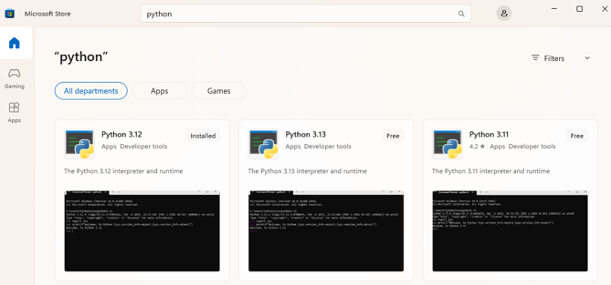
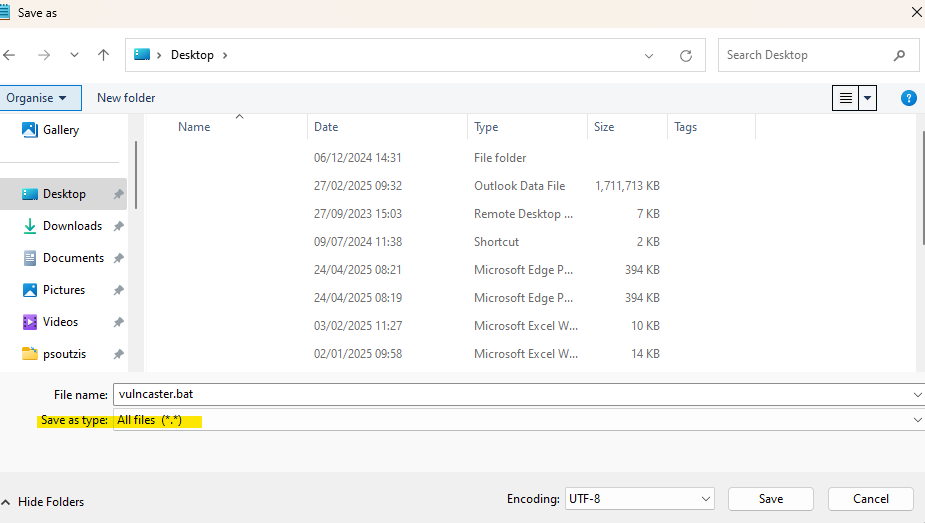
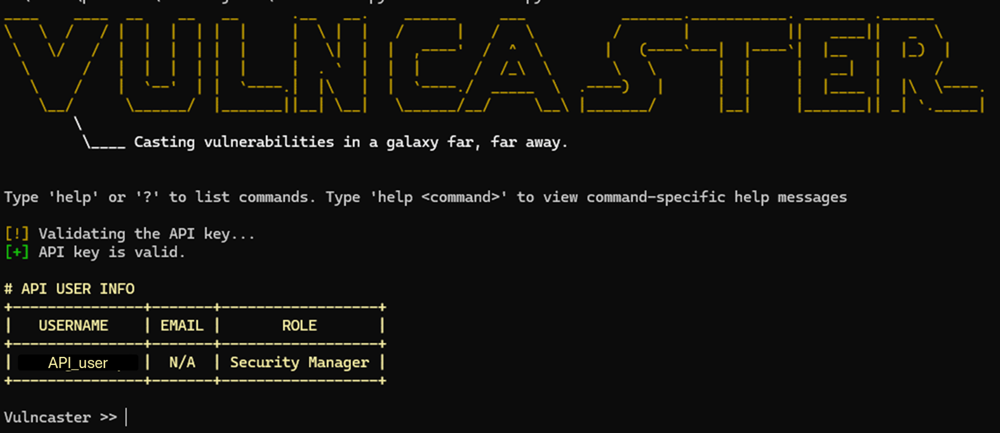
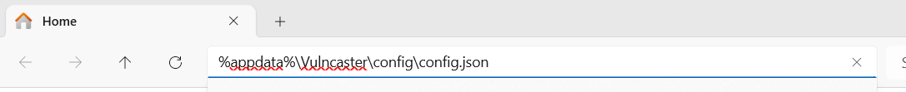
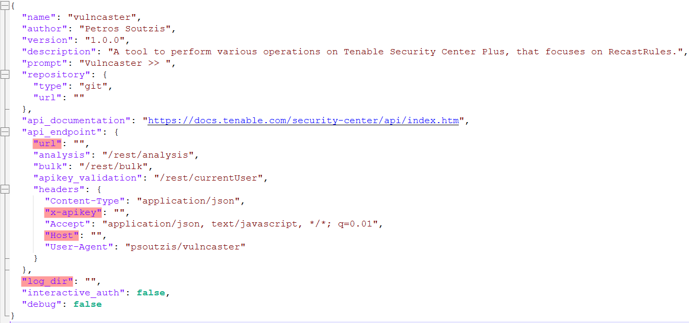
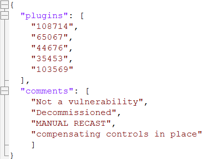
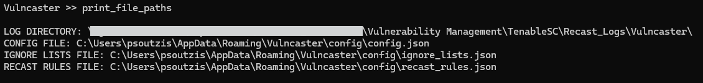

# Introduction 
Vulncaster is a command-line tool that aims to automate the process of creating "Recast Risk" requests to 
Tenable Security Center (by [Tenable®](https://www.tenable.com/products/security-center)).

It is meant to further simplify the process of Vulnerability Management, by adding to the functionality 
of the Tenable SC web application. Additionally, even though this tool is intended to be run on Windows 
machines, it should be platform independent (not tested on unix-based systems).

# Requirements & Installation
## Requirements
The system running Vulncaster requires:

- Network access to the Tenable Security Center instance
- Python 3 interpreter
- Git
- Pip (python's package manager)
- Dependencies included in project's "requirements.txt"

Make sure the python binary is included in PATH.

## Windows Setup
1. Download and install the latest Python 3 version from the Microsoft Store or from the official website.

2. If in a corporate network, allow access to the following domains **from the host that will be running Vulncaster**:
    > pypi.python.org 
    > pypi.org 
    > pythonhosted.org 
    > files.pythonhosted.org

3. Install the Python package manager (Pip): `python -m pip install --upgrade pip`

4. Download and install Git: https://git-scm.com/downloads

5. After installing Git, open a CMD prompt, and enter the following command: `git clone https://github.com/soutzis/Vulncaster.git %appdata%\Vulncaster`
 The above command should then create a new folder in %appdata% called "Vulncaster".

6. In the CMD prompt, type the following command: `notepad %appdata%\Vulncaster\vulncaster.bat`

7. The above will open the file vulncaster.bat in the notepad. You need to use **Save As** and save it on your desktop.  The reason we do this is because the bat file you downloaded from the repository has the *mark of the web (MOTW)* and will not be allowed to run on your computer. However, by saving it yourself on your computer, you also have ownership of this BAT file.
  As shown in the below screenshot, make sure that you **save the type as "All files (*)"**, otherwise you will create a .txt file
 

8. Before running Vulncaster, we need to install the requirements (dependencies) for the project. To do this, we will use a python virtual environment (venv), to make sure that we do not create conflicts with other potential packages that are installed system-wide: 

    `python -m venv %appdata%\Vulncaster\venv-vulncaster`

    // run the activation script  
    `%appdata%\Vulncaster\venv-vulncaster\Scripts\activate.bat`

    `pip install -r %appdata%\Vulncaster\requirements.txt`

    Done, close the cmd window.

9. You can now double-click on the "vulncaster.bat" file (from step 7) on your Desktop, to start Vulncaster. The output should look like this: 

# Quick Start
See below on how to configure your Vulncaster instance.
## config.json
The main configuration file for Vulncaster is held in the 'config' directory of the project, in the file called 'config.json'. Assuming you followed all the instructions correctly from 'Installation & Requirements > Steps to install', you should be able to access the configuration file using this path: `%appdata%\Vulncaster\config\config.json` by pasting it in the Explorer address bar as shown below:

The configuration file has some variables already set for the user's convenience. However, if you wish to do so, they are all configurable.

The highlighted values in the `config.json` file screenshot below **are mandatory** and need to be manually configured:

  - `"url"`: The "url" value under `"api_endpoint"` should have the full URL to your Tenable SC instance (e.g., https://tenablesc.example.com)
  - `"x-apikey"`: Can be left empty, to always prove the value at runtime. Otherwise, see the `config-example.json` file for an example of how the API key looks like. You can retrieve your user's API key from your Tenable SC instance's web application.
  - `"Host"`: This is the host header. It should match your Tenable SC instance.
  - `"log_dir"`: This is the location where the logs and debug files are placed at. If using backslashes, these needs to be escaped, including network share drives:
      - "C:\\\\Users\\\\psoutzis\\\\Documents\\\\vulncaster\\\\log\\\\"
      - "\\\\\\\\networkshare\\\\vulncaster\\\\log\\\\"

 If you wish to make the Vulncaster tool authenticate to the Tenable SC instance automatically when running it, you should make sure that the `"interactive_auth"` value is set to `false`. Having it set to `true`, will cause the script to always ask for the API key on runtime.

 ## ignore_lists.json
 The 'ignore lists' file for Vulncaster is held in the 'config' directory of the project: `%appdata%\Vulncaster\config\ignore_lists.json`

 This file contains all the plugins and comments that should be excluded from recasts. For example, when running recast rules, some of previously-recasted vulnerabilities might be returned from the recast rule query. A good example of this is the use-case of decommissioned hosts. When hosts are decommissioned, the vulnerabilities remain in Tenable SC even though the hosts no longer exist on the network; this skews the organization's status related to Vulnerability Management. Therefore, we need a way to remove these hosts from our results and at the same time allow the automated recast rules to operate without "reviving" vulnerabilities like these.

The solution is to have an 'ignore list' for specific plugins that should not be recasted, as well as for specific "comments". The above JSON file holds ignored comments and plugins that the tool ignores when running the recast rules. Additionally, the tool gives the user the option to review these options (comments and plugins in the ignore-list) before manually recasting a vulnerability.

When Vulncaster is processing a vulnerability that has a comment or a plugin id that matches the ones in the lists in the `ingore_lists.json` file, like the ones below, it will skip those during automatic recasting through recast rules.

The default file has some recommended values for the plugins. The "MANUAL RECAST" comment must never be removed, as it is required for the way that vulncaster handles automatic recasts.

## recast_rules.json
The 'Recast Rules' file for Vulncaster is held in the 'config' directory of the project: `%appdata%\Vulncaster\config\recast_rules.json`

These are the rules that are defined in the company's Vulnerability Management procedure and are expressed as JSON queries of the Tenable Security Center. Your rules should conform to the format found in the `recast_rules-example.json` file.

These can be fully managed through the Vulncaster tool in an interactive way if needed - simply follow the on-screen instructions when running the relevant command.

# Commands
### print_file_paths
The `print_file_paths` command of Vulncaster can help you get see your configured file paths from config.json, as it will print the absolute path for each configuration/log file:

    

